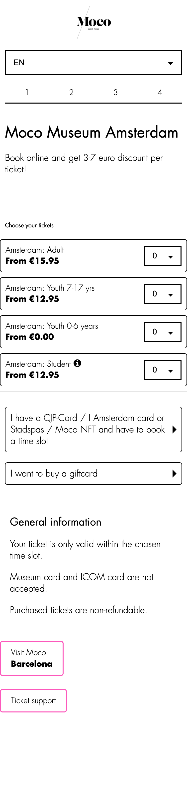

# Procesverslag
Markdown is een simpele manier om HTML te schrijven.  
Markdown cheat cheet: [Hulp bij het schrijven van Markdown](https://github.com/adam-p/markdown-here/wiki/Markdown-Cheatsheet).

Nb. De standaardstructuur en de spartaanse opmaak van de README.md zijn helemaal prima. Het gaat om de inhoud van je procesverslag. Besteedt de tijd voor pracht en praal aan je website.

Nb. Door *open* toe te voegen aan een *details* element kun je deze standaard open zetten. Fijn om dat steeds voor de relevante stuk(ken) te doen.

## Jij

  
uitwerken voor kick-off werkgroep

  ### Auteur:
  Tijn Neve

  #### Je startniveau:
  blauw

  #### Je focus:
  surface plane
 

## Je website

  
uitwerken voor kick-off werkgroep

  ### Je opdracht:
  https://mocomuseum.com
  
  #### Screenshot(s) van de eerste pagina (small screen): 
  Home page  
  

  #### Screenshot(s) van de tweede pagina (small screen):
  hier de naam van de pagina  
  
 

## Toegankelijkheidstest 1/2 (week 1)

  
uitwerking na test in 1e werkgroep

  ### Bevindingen
  Mijn bevindingen:

  #### Screenreader
  - Meerdere keren wordt een button/link benoemd als een tekst element, de functie is dan dus niet duidelijk.
  - Ticket selecteren niet mogelijk met screenreader. Dit moet dus duidelijk benoemd worden, ook omdat dit een belangrijke functie is van de site.
  - Logo wordt niet benoemd als link, terwijl dit een belangrijk element is van de site om terug naar de homepage te navigeren.

  #### Muis en Toetsenbord 
  - Tab werkt goed, alle elementen die je nodig hebben kun je bereiken. Volgorde van de elementen waar je doorheen tabt zijn logisch.
  - Titel van de verschillende stappen op je detailpagina zijn niet interactief. Dit is verwarrend en zou makkelijk zijn als dit wel zo zou zijn.

  #### Motoriek (shocks, elastiekjes)
  Twee vingers vast test (aan beide handen):
  - Prima te doen, het is vooral scrollen en alles is breed opgezet. Dit werkt dus goed.
  - Selector op detailpagina gaat goed.
  Shocks:
  - Prima te doen, het is vooral veel scrollen en weinig precieze knoppen of dingen die je in moet vullen.
  - Links zijn breed opgezet en zijn dus goed te selecteren. Hierdoor is dan kans dat je perongeluk op een verkeerde link drukt ook niet zo groot.

  #### Visueel (brillen, contrast, kleurenblind, dark/light). 
  - Geen darkmode aanwezig
  Diabetic / vlekken in zicht:
  - Font in wit / roze is zeer slecht leesbaar.
  - Strepen zijn afleidend.
  - Amsterdam / Barcelona button en tekst slecht leesbaar.
  - Dun font zwart & roze combi slecht leesbaar, hover is wel heel duidelijk.
  - Streepje onder interactieve elementen waar je overheen hovert is ook heel duidelijk.
  Kleurenblind:
  - Wit wordt geel, opzich geen grote beperking. Alleen de geel/roze combi slechter zichtbaar.
  - Overige kleuren en contrasten zijn prima zichtbaar, en geen beperking voor iemand die kleurenblind is.
  Blur:
  - Titel is goed leesbaar, de rest niet.
  - Meer info niet leesbaar, font is te dun.
  - Hoverstate met een streep eronder is erg fijn, hierdoor zie je dat een element interactief is.
  - Detailpagina niet leesbaar, font is te dun. Grijs op wit valt weg. Goed dat de aantallen apart worden aangegeven, dit maakt het duidelijker.
  Staar (midden blind):
  - Afbeeldingen vallen weg, zijn in midden weergegeven.
  - Tekst op de homepagina valt weg.
  - Detailpagina tekst niet te lezen, hover met roze als enige duidelijk omdat het contrast zo groot is.
  Laag contrast:
  - Dunne witte tekst valt weg op roze.
  - Tekst moet dikker.

## Breakdownschets (week 1)

  
uitwerken na afloop 2e werkgroep

  ### de hele pagina: 
  

  ### dynamisch deel (bijv menu): 
  

  ### wellicht nog een dynamisch deel (bijv filter): 
  

## Voortgang 1 (week 2)

  
uitwerken voor 1e voortgang

  ### Stand van zaken
  hier dit ging goed & dit was lastig (neem ook screenshots op van delen van je website en code)

  ### Agenda voor meeting
  samen met je groepje opstellen

  | Tijn           | Yente              | Tufan.       | student 4        |
  | ---            | ---                | ---          | ---              |
  | breakdown      | HTML               | header       | breakdown        |
  | achtergrond    |                    |              | articles         |
  | ...            | ...                | ...          | ...              |

  ### Verslag van meeting
  hier na afloop snel de uitkomsten van de meeting vastleggen

  - Header niet als list items
  - Keuzes maken tussen relevante elementen van de homepage

## Voortgang 2 (week 3)

  
uitwerken voor 2e voortgang

  ### Stand van zaken
  - Het is nog niet gelukt om een video als achtergrond te plaatsen. Hoe download is een video van de site. Hoe zorg ik ervoor dat de video ook achter de
    header komt, moet ik dan een section toevoegen?
  - Het lukt niet om mijn header sticky te maken.
  - Ik moet de font kleuren nog aanpassen naar custom properties, heb ze nu apart benoemd.
  - Mijn code is niet super efficient geschreven, ik heb het gevoel dat het soms bondiger kan. Hoe erg is dit?

  ### Agenda voor meeting
  samen met je groepje opstellen

  | Tijn           | Yente              | Tufan        | Robin        |
  | ---            | ---                | ---          | ---              |
  | video als achtergrond?  | fout in css             |     | kun je een button in een nav verwerken?    |
  | header sticky lukt niet |      |  |  |
  | ...            | ...                | ...          | ...              |

  ### Verslag van meeting
  hier na afloop snel de uitkomsten van de meeting vastleggen

- amsterdam / barcelona slide is een button
- h2 toevoegen met display none als iets een h3 is
- ul toevoegen met aparte li items voor styling
- footer is een nav en een ul
- z index om header
- position sticky met een positie toevoegen aan de header

## Toegankelijkheidstest 2/2 (week 4)

  
uitwerken na test in 8e werkgroep

  ### Bevindingen
  Lijst met je bevindingen die in de test naar voren kwamen (geef ook aan wat er verbeterd is):

  #### Screenreader
  Hier korte omschrijving (met indien nodig afbeeldingen)

  Hier een omschrijving van hoe het opgelost kan worden (met indien nodig afbeeldingen)

  #### Muis en Toetsenbord 
  Hier korte omschrijving (met indien nodig afbeeldingen)

  Hier een omschrijving van hoe het opgelost kan worden (met indien nodig afbeeldingen)

  #### Motoriek (shocks, elastiekjes)
  Hier korte omschrijving (met indien nodig afbeeldingen)

  Hier een omschrijving van hoe het opgelost kan worden (met indien nodig afbeeldingen)

  #### Visueel (brillen, contrast, kleurenblind, dark/light). 
  Hier korte omschrijving (met indien nodig afbeeldingen)

  Hier een omschrijving van hoe het opgelost kan worden (met indien nodig afbeeldingen)

## Voortgang 3 (week 4)

  
uitwerken voor 3e voortgang

  ### Stand van zaken
  hier dit ging goed & dit was lastig (neem ook screenshots op van delen van je website en code)

  ### Agenda voor meeting
  samen met je groepje opstellen

  | Tijn      | Yente          | student 3    | student 4        |
  | ---            | ---                | ---          | ---              |
  | breakdown detail pagina  | twee elementen kan veranderen door 1 actie uit te voeren in js. en het stijlen van een radio button werkt niet bij mij            |    |    |
  |  |  |  |  |
  | ...            | ...                | ...          | ...              |

  ### Verslag van meeting
  hier na afloop snel de uitkomsten van de meeting vastleggen

  - punt 1
  - punt 2
  - nog een punt
  - ...

## Eindgesprek (week 5)

  
uitwerken voor eindgesprek

  ### Je uitkomst - karakteristiek screenshots:
  

  ### Dit ging goed/Heb ik geleerd: 
  Korte omschrijving met plaatjes

  

  ### Dit was lastig/Is niet gelukt:
  Korte omschrijving met plaatjes

  

## Bronnenlijst

  
continu bijhouden terwijl je werkt

  Nb. Wees specifiek ('css-tricks' als bron is bijv. niet specifiek genoeg).

  1. bron 1
  2. bron 2
  3. ...

